

# 📊 Projeto de Análise e Desenvolvimento de Sistemas

---

### 📚 Análise e Projeto de Sistemas I  
👨‍🏫 Professor: Ricardo Roberto de Lima  
🏫 Centro Universitário de João Pessoa – UNIPÊ  

---

---

## 🚀 Sobre o Projeto

Este repositório reúne a resolução completa de **11 exercícios acadêmicos**, aplicando conceitos fundamentais de:

- 📐 Modelagem UML (Diagramas de Classes)
- 📋 Engenharia de Requisitos
- 🧠 Análise de Sistemas
- 🐍 Programação em Python
- ⚡ Interface com Streamlit

---

## 🧩 Estrutura dos Diagramas UML

Cada questão possui sua própria modelagem de classes:

| Questão | Tema |
|--------|------|
| 01 | Conta de Luz |
| 02 | TextoSaída |
| 03 | Boneco em Movimento |
| 04 | Horário de Remédios |
| 05 | Gastos Diários |
| 06 | Comanda Eletrônica |
| 07 | Lista de Compras |
| 08 | Coleção de CDs |
| 09 | Variação de Coleção de CDs |
| 10 | Sala de Reunião |
| 11 | Herança |

---

## 🖼️ Diagramas UML

### 📍 Questão 01
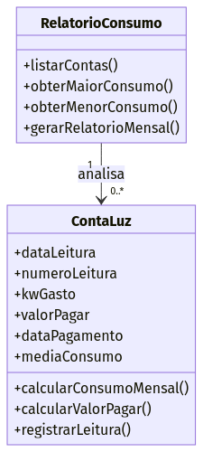

### 📍 Questão 02
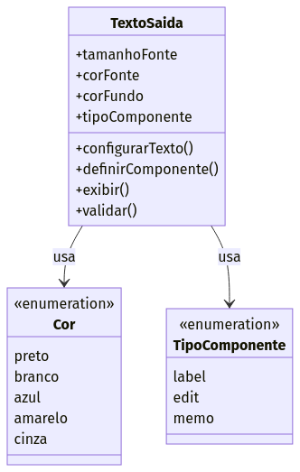

### 📍 Questão 03
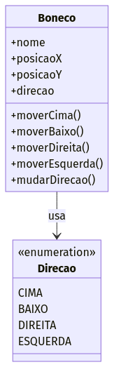

### 📍 Questão 04
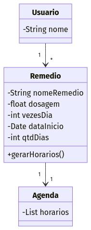

### 📍 Questão 05
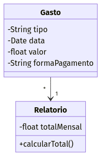

### 📍 Questão 06
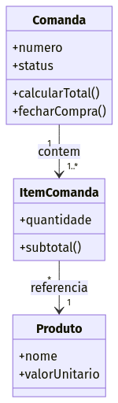

### 📍 Questão 07
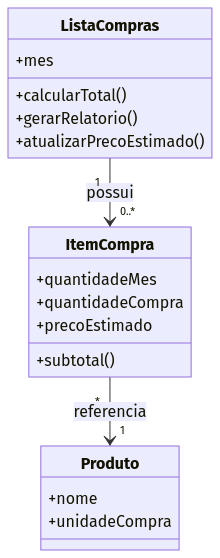

### 📍 Questão 08
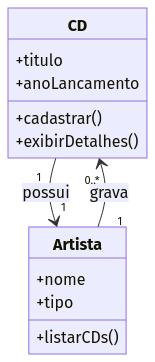

### 📍 Questão 09
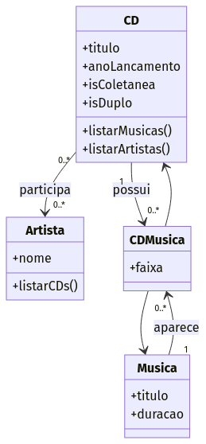

### 📍 Questão 10
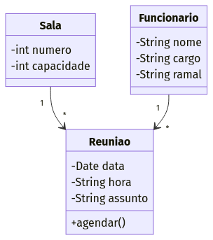

### 📍 Questão 11
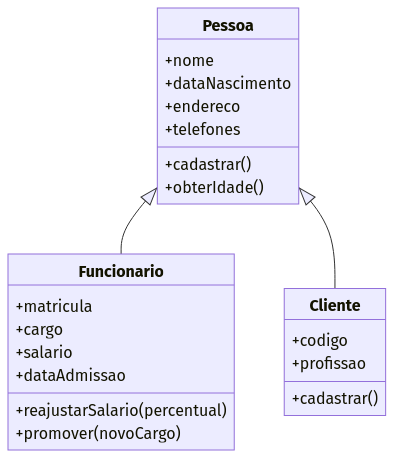

---

## 💻 Tecnologias Utilizadas

- Python 🐍
- Streamlit ⚡
- Pandas 📊
- UML (Modelagem de Sistemas) 📐
